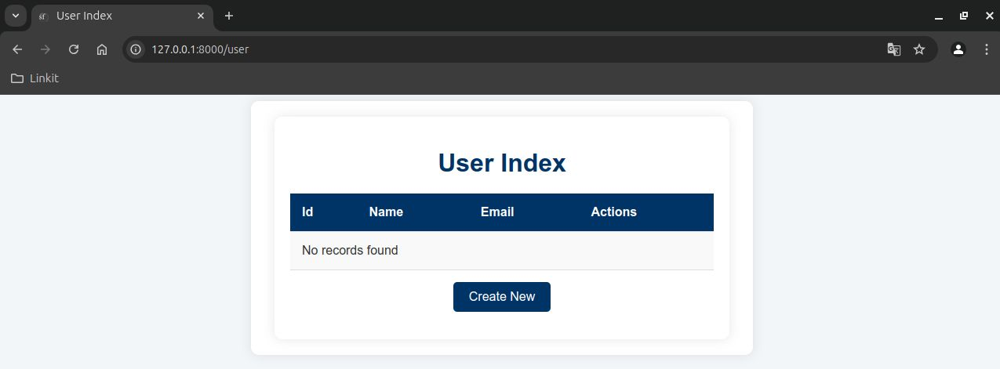
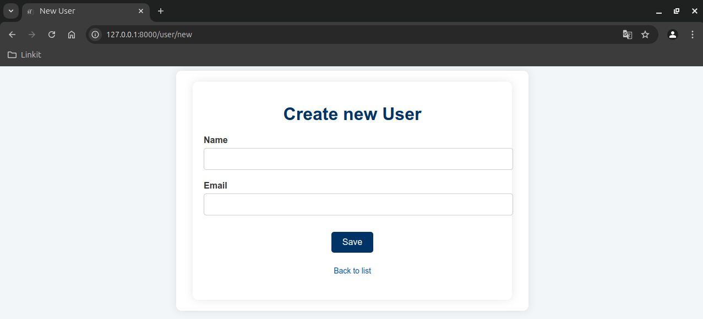
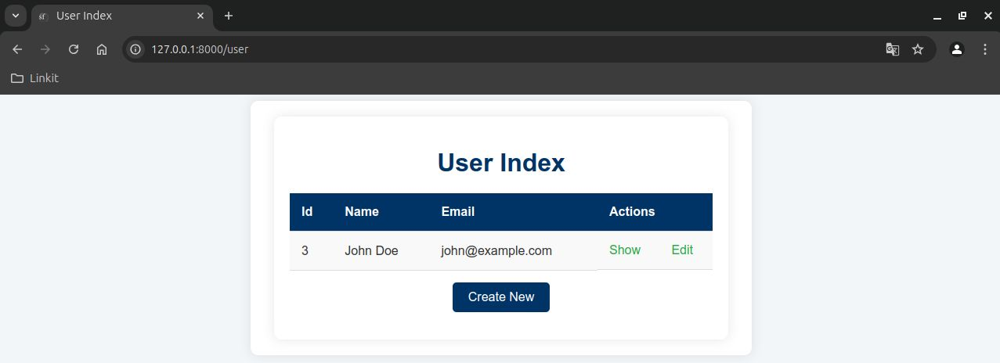
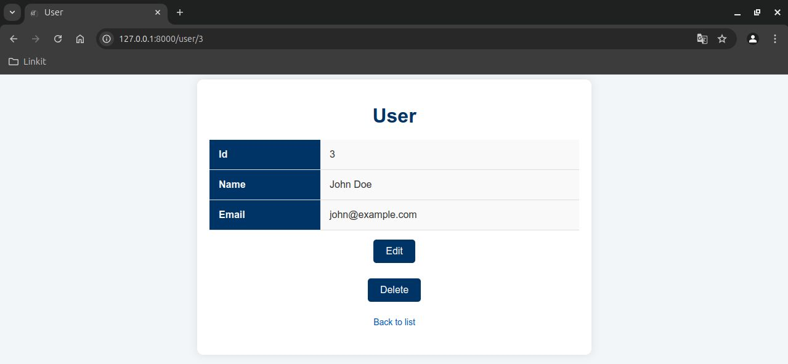
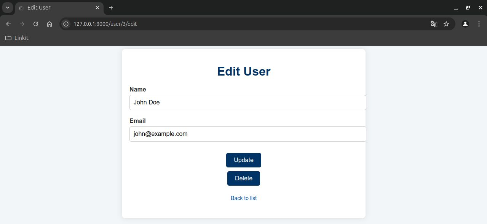

# My CRUD Application

## Overview

This is a simple CRUD (Create, Read, Update, Delete) application built with Symfony and PostgreSQL. It allows users to manage user information, including names and email addresses. The project utilizes Doctrine ORM for database interactions.

## Features

- User registration and management
- Responsive design
- Database interactions using Doctrine ORM
- Easy setup and configuration

## Prerequisites

Before you begin, ensure you have met the following requirements:

- [PHP](https://www.php.net/downloads) (version 8.1 or higher)
- [Composer](https://getcomposer.org/download/)
- [PostgreSQL](https://www.postgresql.org/download/)
- Docker (optional for containerized PostgreSQL)

## Installation

1. **Clone the repository:**

   ```bash
   git clone https://github.com/yourusername/my_crud_app.git
   cd my_crud_app
   ```
2. **Install PHP dependencies**

```bash
composer install
```
3. **Set up the database**

- Configure your `.env` file to connect to your PostgreSQL database.
- Create the database:

```bash
php bin/console doctrine:database:create
```
4. **Run migrations to create tables**

```bash
php bin/console doctrine:migrations:migrate
```
5. **Run the application**

You can start the Symfony server with:

```bash
symfony serve
```
Or, if you’re using Docker, make sure your PostgreSQL container is running:

```bash
docker run --name pg_container -e POSTGRES_PASSWORD=yourpassword -e POSTGRES_USER=yourusername -e POSTGRES_DB=my_crud_app -p 30432:5432 -d postgres:14
```

## Usage

After starting the server, navigate to `http://localhost:8000/user` in your web browser. You can register new users, view the user list, and manage user information.

## Screenshots




