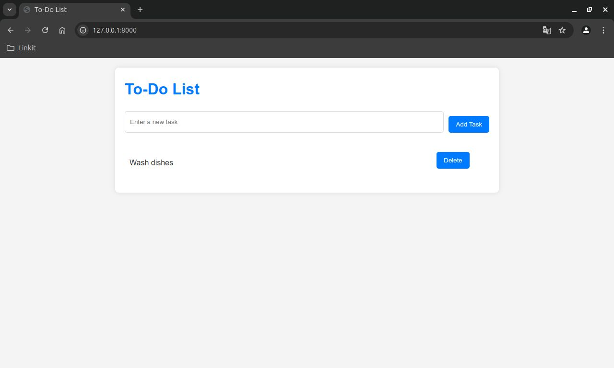

# PHP To-Do List

A simple web-based To-Do list application built using PHP and Laravel. This project demonstrates the basics of handling forms, database integration, and rendering dynamic content in PHP using Laravel.

## Features

- Add tasks to your to-do list
- Display the current list of tasks
- Delete tasks from the list
- Database persistence using Laravel migrations and models
- Basic UI styling with custom CSS

## Requirements

- PHP 8.0 or higher
- Composer
- Laravel 11.24.1
- PostgreSQL (or any supported database)

## Installation

**Clone the repository (or download the files):**

```bash
git clone https://github.com/yourusername/php-todo-laravel-app.git
```
**Navigate to the project directory:**

```bash
cd php-todo-laravel-app
```
**Install PHP dependencies via Composer**

```bash
composer install
```

**Create `.env` file**

```bash
cp .env.example .env
```
Update the .env file to match your database configuration.

**Generate an application key**

```bash
php artisan key:generate
```
**Run migrations**

```bash
php artisan migrate
```

**Serve the application**

```bash
php artisan serve
```

**Access the application**

Open your web browser and go to `http://127.0.0.1:8000`.

## File Structure
```bash
/php-todo-app
  ├── app/Http/Controllers/TaskController.php   # Handles task CRUD operations
  ├── resources/views/tasks/index.blade.php     # Main view for tasks
  ├── public/css/app.css                        # Custom styles for the to-do list
  ├── database/migrations                       # Migration files for tasks table
  └── README.md                                 # Project documentation
```

## Custom CSS
The custom CSS file (`app.css`) is located in the `public/css/` folder. To manage and modify the styles:

- Update the CSS in `resources/css/app.css`.
- Manually copy the updated CSS to the`public/css/` folder for changes to take effect.

## Styling
- Task list items are displayed without bullets.
- Delete buttons are centered relative to the tasks.
- Input form has additional spacing between the text field and the "Add Task" button.
- Overall UI styling is minimal and responsive.

## Screenshots


## Usage
- **Add a new task**: Use the input form to add a task.
- **Delete a task**: Click the "Delete" button next to any task to remove it.


